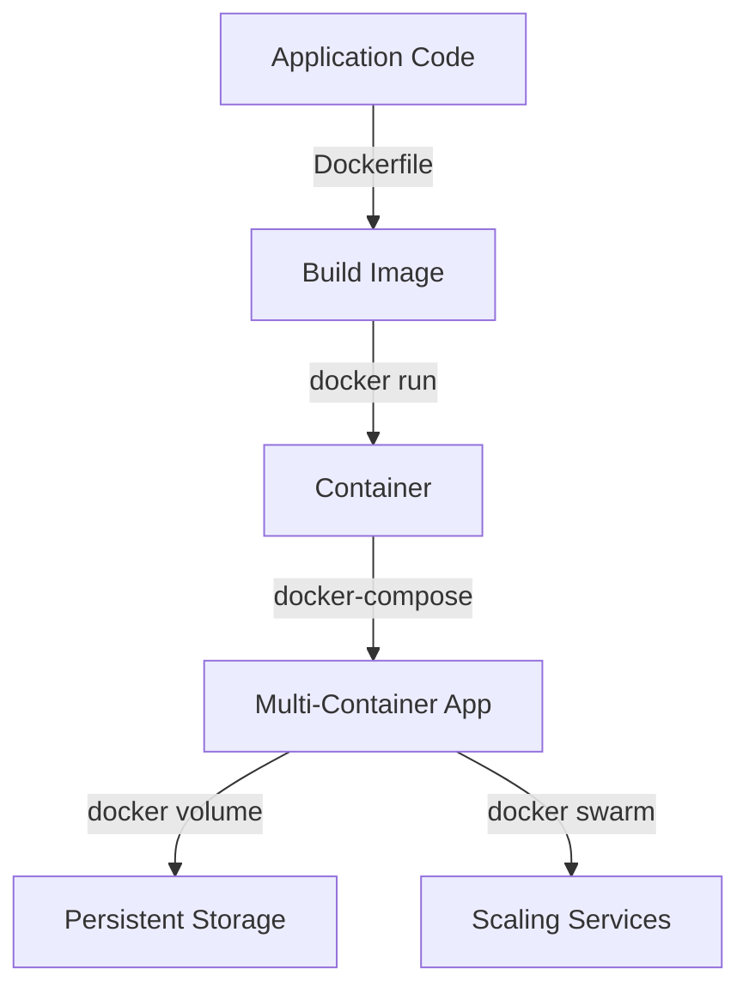

# Docker-CLI

This repository provides a collection of Docker and CLI scripts to virtualize, scale, and manage applications. It includes Dockerfiles for Node.js and Python applications, as well as scripts for Docker Swarm, volumes, and startup automation.

---

## Structure

```
Docker-CLI/
│── Docker-Start.sh           # CLI commands to virtualize application
│── Docker-swarm.sh           # Scaling commands for Docker Swarm
│── Docker-volume.sh          # Volume management (Jenkins issue fix)
│── NodeJS.Dockerfile         # Dockerfile for Node.js applications
│── Python.Dockerfile         # Dockerfile for Python apps (exposing specific port)
│── workDirectory.Dockerfile  # Work directory Dockerfile
│── docker-compose.yaml       # Compose file for multi-container setup
│── README.md                 # Project Info 
```

---

## Workflow



---

## Features
- Predefined **Dockerfiles** for Node.js and Python.
- **Shell scripts** for container management and scaling.
- **Docker Compose** for multi-container orchestration.
- **Volume support** for persistent storage.
- **Swarm commands** for distributed scaling.

---

## Prerequisites
- Docker Installed 
- Docker Compose
- DockerHub Account (for pushing your registry/image)
- Docker Swarm for scaling OR switch to Kubernetes Cluster (Prefereed)
- AWS/GCP account for EC2 Instance 

---

